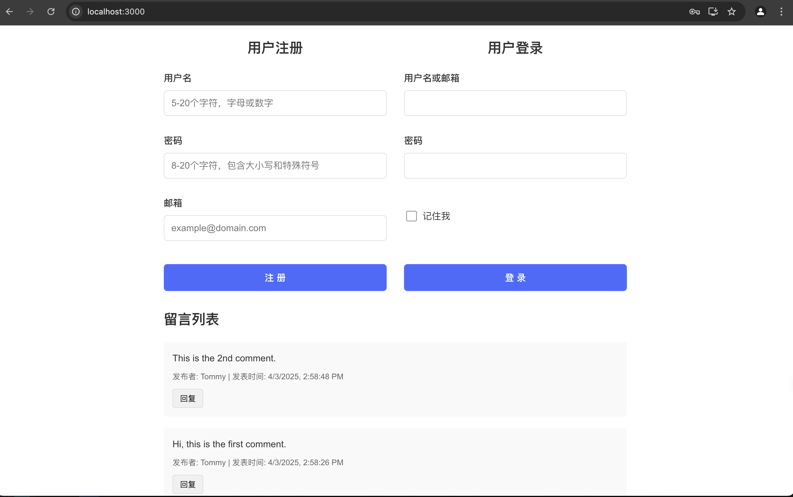
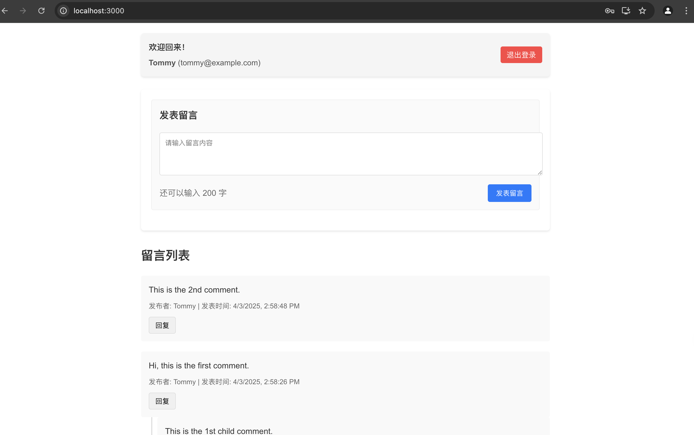

# Hierarchical Forum System - Quick Start Guide

## Prerequisites
- Java 17+ (for backend)
- Node.js 16+ & npm (for frontend)

## Startup Procedure

### 1. Start the Backend (Spring Boot)
```bash
cd backend
./mvnw spring-boot:run
```

The backend will start at http://localhost:8080

### 2. Start the Frontend (React + TypeScript)
```bash
cd frontend/hierarchical-forum-ui
npm install         # Install dependencies
npm install axios   # Add HTTP client
npm start           # Launch development server
```

The frontend will open at http://localhost:3000

## First Time Usage
Access http://localhost:3000 in your browser

You'll see:

- Public View: All comments (read-only without login)
- Register/Login Page: For user authentication

After registration/login, you can:

- Post new comments
- Interact with the thread hierarchy

Here is the screenshot for register and login page:


Here is the screenshot for seeing the comments after login:


## Key Features
- Guest users can view comments
- Authenticated users can post comments
- Hierarchical thread display